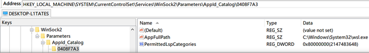

Hello, welcome to my personal knowledgebase article 😁

I think you only get this if you have some tool or service which hooks WinSock to perform content inspection, but if you do, you need to tell WinSock to reject attempts to hook WSL2.

According to this post on the Github WSL Issues list, you need to add a key into your registry, in the path `HKEY_LOCAL_MACHINE\SYSTEM\CurrentControlSet\Services\WinSock2\Parameters\AppId_Catalog` and they mention that the vendor of “proxifier” have released a tool which creates this key. The screen shot in the very next post shows this registry key having been created.
A screenshot of a screenshot of the registry path needed to prevent WinSock from being hooked.



I don’t know if the hex ID of the “AppId_Catalog” path created is relevant, but it was what was in the screenshot, so I copied it, and created this registry export file. Feel free to create your own version of this file, and run it to fix your own issue.

Windows Registry Editor Version 5.00

```
[HKEY_LOCAL_MACHINE\SYSTEM\CurrentControlSet\Services\WinSock2\Parameters\AppId_Catalog\0408F7A3]
"AppFullPath"="C:\\Windows\\System32\\wsl.exe"
"PermittedLspCategories"=dword:80000000
```

As soon as I’d included this registry entry, I was able to access WSL OK again.

Featured image is “Prickily Hooks” by “Derek Gavey” on Flickr and is released under a CC-BY license.

Retrieved from [JonTheNiceGuy](https://jon.sprig.gs/blog/post/2140)